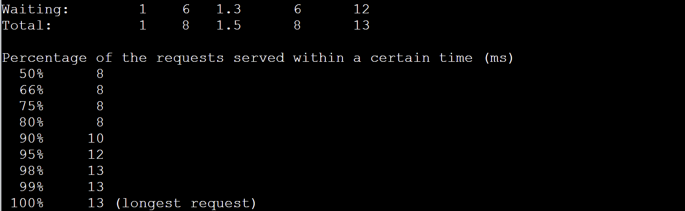

Di Client

```sh
mkdir -p /Jarkom-Modul-3-D06-2023/testingdata
```

## 1. Load Balancer

Di LB

```
nano /etc/nginx/sites-available/lb-jarkom
upstream myweb  {
  server 192.194.3.1;
  server 192.194.3.2;
  server 192.194.3.3;
}
service nginx reload
service nginx restart
```

Testing di Client

```sh
ab -n 200 -g /Jarkom-Modul-3-D06-2023/testingdata/no8RoundRobin.data -c 10 http://granz.channel.D06.com/
```

Result




## 2. Weighted Load Balancer

Di LB

```
nano /etc/nginx/sites-available/lb-jarkom
upstream myweb  {
  server 192.194.3.1 weight=4;
  server 192.194.3.2 weight=2;
  server 192.194.3.3 weight=1;
}
service nginx reload
service nginx restart
```

Testing di Client

```sh
ab -n 200 -g /Jarkom-Modul-3-D06-2023/testingdata/no8WeightedRoundRobin.data -c 10 http://granz.channel.D06.com/
```

Result


## 3. Least Connection

Di LB

```
nano /etc/nginx/sites-available/lb-jarkom
upstream myweb  {
  least_conn;
  server 192.194.3.1;
  server 192.194.3.2;
  server 192.194.3.3;
}
service nginx reload
service nginx restart
```

Testing di Client

```sh
ab -n 200 -g /Jarkom-Modul-3-D06-2023/testingdata/no8LeastConnection.data -c 10 http://granz.channel.D06.com/
```

Result


## 4. IP Hash

Di LB

```
nano /etc/nginx/sites-available/lb-jarkom
upstream myweb  {
  ip_hash;
  server 192.194.3.1;
  server 192.194.3.2;
  server 192.194.3.3;
}
service nginx reload
service nginx restart
```

Testing di Client

```sh
ab -n 200 -g /Jarkom-Modul-3-D06-2023/testingdata/no8IPHash.data -c 10 http://granz.channel.D06.com/
```

Result


## 5. Generic Hash

Di LB

```
nano /etc/nginx/sites-available/lb-jarkom
upstream myweb  {
  hash $request_uri consistent;
  server 192.194.3.1;
  server 192.194.3.2;
  server 192.194.3.3;
}
service nginx reload
service nginx restart
```

Testing di Client

```sh
ab -n 200 -g /Jarkom-Modul-3-D06-2023/testingdata/no8GenericHash.data -c 10 http://granz.channel.D06.com/
```

Result


