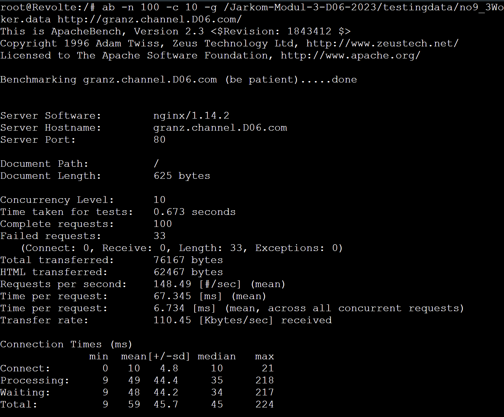
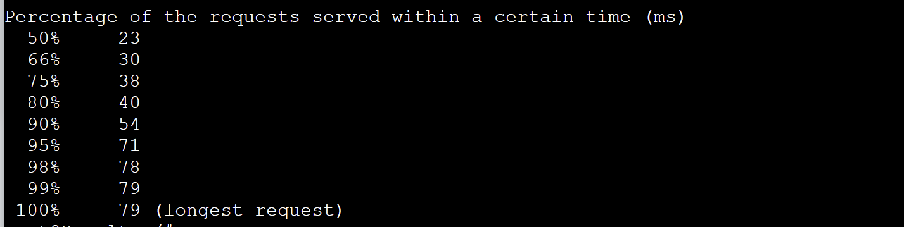
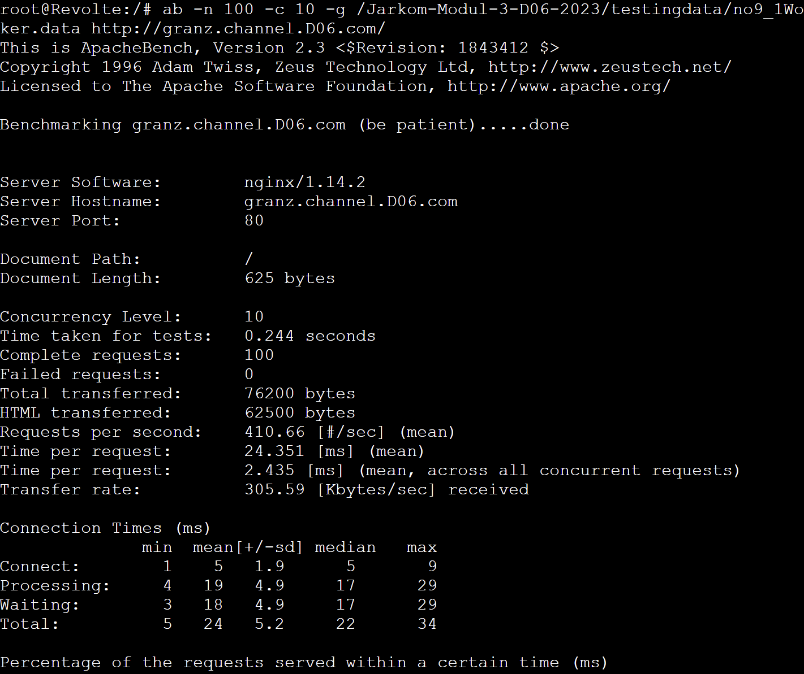
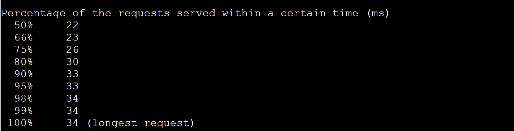

Di LB

```
nano /etc/nginx/sites-available/lb-jarkom
upstream myweb  {
  server 192.194.3.1;
  server 192.194.3.2;
  server 192.194.3.3;
}
service nginx reload
service nginx restart
```

1. 3 Worker

Testing di Client

```sh
ab -n 100 -c 10 -g /Jarkom-Modul-3-D06-2023/testingdata/no9_3Worker.data http://granz.channel.D06.com/
```

Result




2. 2 Worker

(Matiin 1 PHP Worker => service nginx stop)

Testing di Client

```sh
ab -n 100 -c 10 -g /Jarkom-Modul-3-D06-2023/testingdata/no9_2Worker.data http://granz.channel.D06.com/
```

Result




3. 1 Worker

(Matiin 2 PHP Worker => service nginx stop)

Testing di Client

```sh
ab -n 100 -c 10 -g /Jarkom-Modul-3-D06-2023/testingdata/no9_1Worker.data http://granz.channel.D06.com/
```

Result




