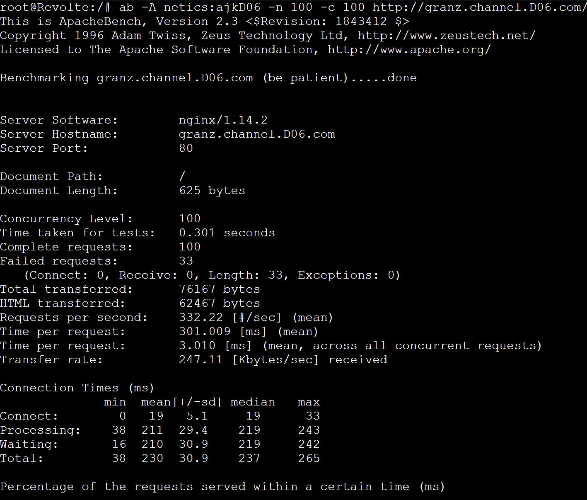
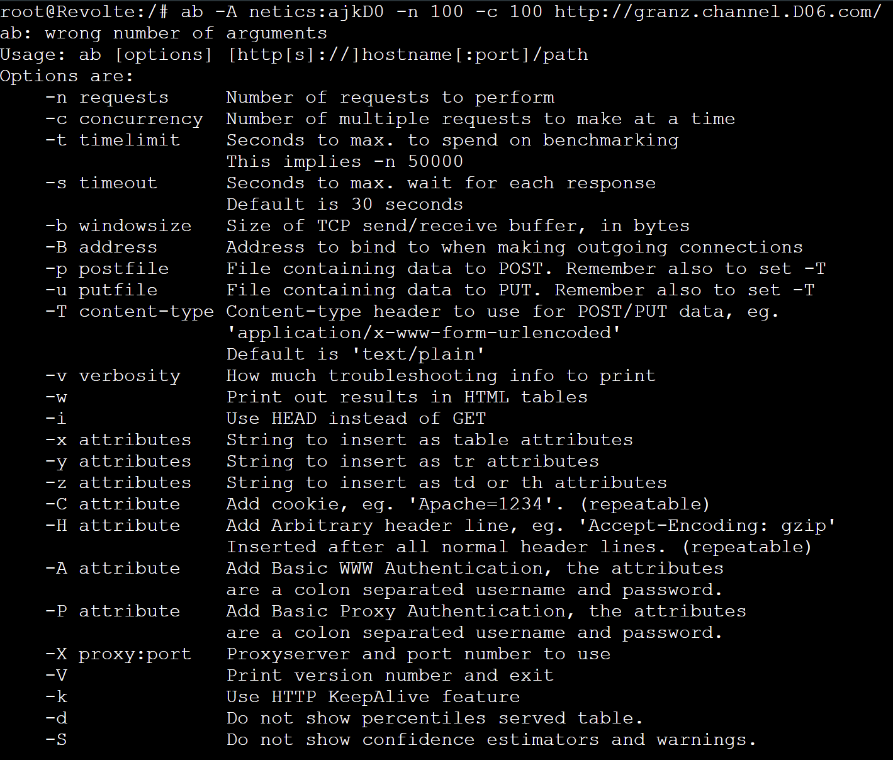
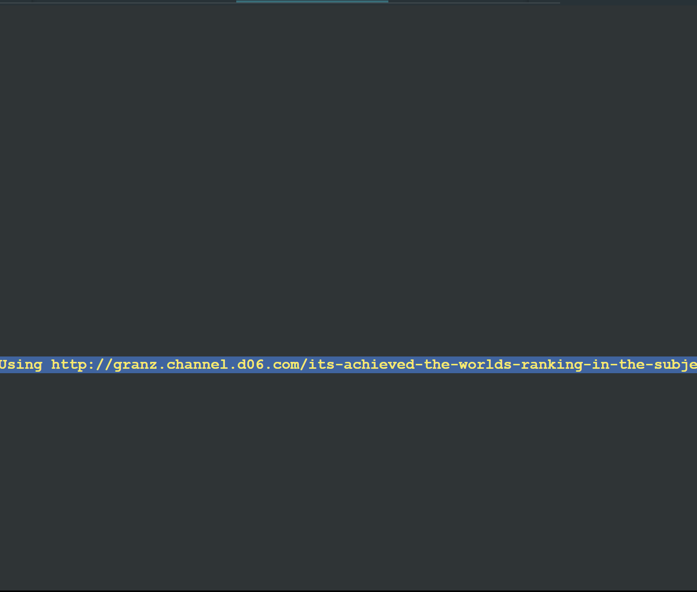
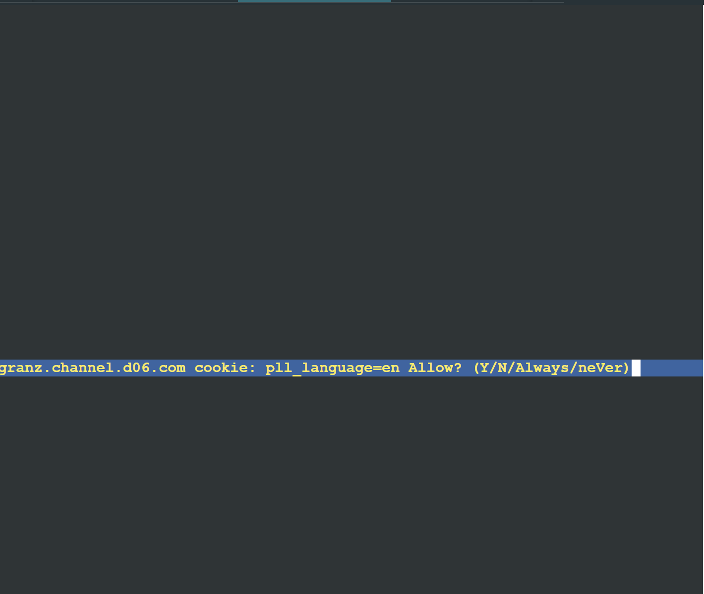
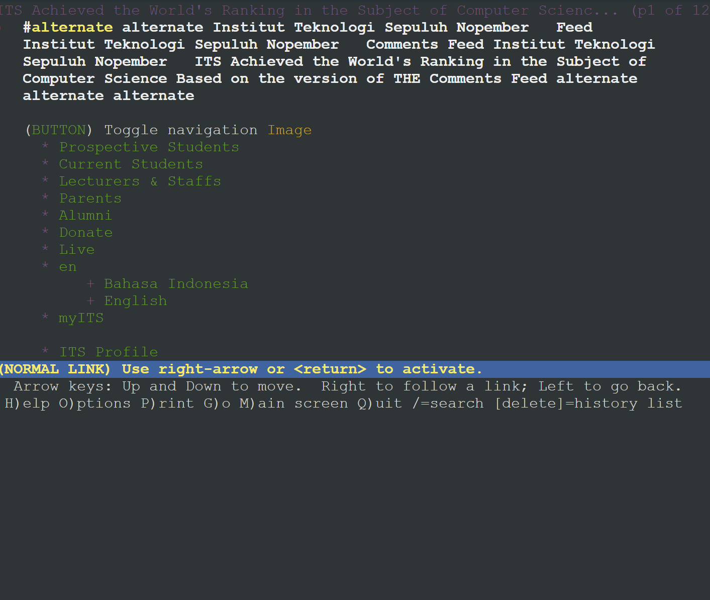
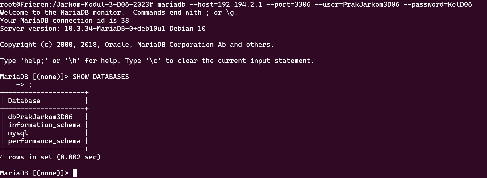

# <div align="center"><p>Jarkom-Modul-3-D06-2023</p></div>

## Anggota Kelompok

| Nama                               | NRP        |
| ---------------------------------- | ---------- |
| Achmad Khosyi’ Assajjad Ramandanta | 5025211007 |
| Daud Dhiya' Rozaan                 | 5025211021 |

## No 0

Untuk mendaftarkan domain, kita setup `DNS Server` sebagai berikut :

```sh
apt-get update
apt-get install bind9 -y

echo '
zone "canyon.D06.com" {
    type master;
    file "/etc/bind/jarkom/canyon.D06.com";
};

zone "1.194.192.in-addr.arpa" {
    type master;
    file "/etc/bind/jarkom/1.194.192.in-addr.arpa";
};

zone "channel.D06.com" {
    type master;
    file "/etc/bind/jarkom/channel.D06.com";
};' >/etc/bind/named.conf.local

mkdir -p /etc/bind/jarkom

cp /etc/bind/db.local /etc/bind/jarkom/canyon.D06.com
echo '
;
; BIND data file for local loopback interface
;
$TTL    604800
@       IN      SOA     canyon.D06.com. root.canyon.D06.com. (
                        2023110101    ; Serial
                        604800        ; Refresh
                        86400         ; Retry
                        2419200       ; Expire
                        604800 )      ; Negative Cache TTL
;
@               IN      NS      canyon.D06.com.
@               IN      A       192.194.1.2 ; IP DNS Server
www             IN      CNAME   canyon.D06.com.
riegel          IN      A       192.194.4.1 ; IP Fern Laravel Worker' >/etc/bind/jarkom/canyon.D06.com

cp /etc/bind/db.local /etc/bind/jarkom/1.194.192.in-addr.arpa
echo '
;
; BIND data file for local loopback interface
;
$TTL    604800
@       IN      SOA     canyon.D06.com. root.canyon.D06.com. (
                        2023110101    ; Serial
                        604800        ; Refresh
                        86400         ; Retry
                        2419200       ; Expire
                        604800 )      ; Negative Cache TTL
;
1.194.192.in-addr.arpa. IN  NS      canyon.D06.com.
2                       IN  PTR     canyon.D06.com.' >/etc/bind/jarkom/1.194.192.in-addr.arpa

cp /etc/bind/db.local /etc/bind/jarkom/channel.D06.com
echo '
;
; BIND data file for local loopback interface
;
$TTL    604800
@       IN      SOA     channel.D06.com. root.channel.D06.com. (
                        2023110101    ; Serial
                        604800        ; Refresh
                        86400         ; Retry
                        2419200       ; Expire
                        604800 )      ; Negative Cache TTL
;
@               IN      NS      channel.D06.com.
@               IN      A       192.194.1.2 ; IP DNS Server
www             IN      CNAME   channel.D06.com.
granz           IN      A       192.194.3.1 ; IP Lugner PHP Worker' >/etc/bind/jarkom/channel.D06.com

echo 'options {
        directory "/var/cache/bind";

        forwarders {
            192.168.122.1;
        };

        // dnssec-validation auto;
        allow-query{any;};
        auth-nxdomain no; # conform to RFC1035
        listen-on-v6 { any; };
}; ' >/etc/bind/named.conf.options

service bind9 restart
```

Lalu kita lakukan testing di `Client` dengan syntax berikut :

```sh
apt-get update
apt-get install dnsutils -y

echo '
# nameserver 192.168.122.1
nameserver 192.194.1.2 ; IP DNS Server
' >/etc/resolv.conf

printf '\n'
host -t A riegel.canyon.D06.com
printf '\n'
host -t PTR 192.194.1.2
printf '\n'
ping -c 5 riegel.canyon.D06.com
printf '\n'
ping -c 5 canyon.D06.com
printf '\n'

host -t A granz.channel.D06.com
printf '\n'
ping -c 5 granz.channel.D06.com
printf '\n'
ping -c 5 channel.D06.com
printf '\n'
```

## No 1

Buat Topologi & Konfigurasi masing2 node **(untuk DCP Client masih menggunakan static IP)**

### Aura (Router - DHCP Relay):

```
auto eth0
iface eth0 inet dhcp
up iptables -t nat -A POSTROUTING -o eth0 -j MASQUERADE -s 192.194.0.0/16

auto eth1
iface eth1 inet static
	address 192.194.1.0
	netmask 255.255.255.0

auto eth2
iface eth2 inet static
	address 192.194.2.0
	netmask 255.255.255.0

auto eth3
iface eth3 inet static
	address 192.194.3.0
	netmask 255.255.255.0

auto eth4
iface eth4 inet static
	address 192.194.4.0
	netmask 255.255.255.0
```

### SWITCH 3

#### Revolte (DHCP Client)

```
auto eth0
iface eth0 inet static
	address 192.194.3.5
	netmask 255.255.255.0
	gateway 192.194.3.0
	up echo nameserver 192.168.122.1 > /etc/resolv.conf
```

#### Richter (DHCP Client)

```
auto eth0
iface eth0 inet static
	address 192.194.3.4
	netmask 255.255.255.0
	gateway 192.194.3.0
	up echo nameserver 192.168.122.1 > /etc/resolv.conf
```

#### Lawine (PHP Worker)

```
auto eth0
iface eth0 inet static
	address 192.194.3.3
	netmask 255.255.255.0
	gateway 192.194.3.0
	up echo nameserver 192.168.122.1 > /etc/resolv.conf
```

#### Linie (PHP Worker)

```
auto eth0
iface eth0 inet static
	address 192.194.3.2
	netmask 255.255.255.0
	up echo nameserver 192.168.122.1 > /etc/resolv.conf
	gateway 192.194.3.0
```

#### Lugner (PHP Worker)

```
auto eth0
iface eth0 inet static
	address 192.194.3.1
	netmask 255.255.255.0
	gateway 192.194.3.0
	up echo nameserver 192.168.122.1 > /etc/resolv.conf
```

### SWITCH 2

#### Denken (Database Server)

```
auto eth0
iface eth0 inet static
	address 192.194.2.1
	netmask 255.255.255.0
	gateway 192.194.2.0
	up echo nameserver 192.168.122.1 > /etc/resolv.conf
```

#### Eisen (Load Balancer)

```
auto eth0
iface eth0 inet static
	address 192.194.2.2
	netmask 255.255.255.0
	gateway 192.194.2.0
	up echo nameserver 192.168.122.1 > /etc/resolv.conf
```

### SWITCH 1

#### Himmel (DHCP Server)

```
auto eth0
iface eth0 inet static
	address 192.194.1.1
	netmask 255.255.255.0
	gateway 192.194.1.0
	up echo nameserver 192.168.122.1 > /etc/resolv.conf
```

#### Heiter (DNS Server)

```
auto eth0
iface eth0 inet static
	address 192.194.1.2
	netmask 255.255.255.0
	gateway 192.194.1.0
	up echo nameserver 192.168.122.1 > /etc/resolv.conf
```

SWITCH 4

#### Sein (DHCP Client)

```
auto eth0
iface eth0 inet static
	address 192.194.4.5
	netmask 255.255.255.0
	gateway 192.194.4.0
	up echo nameserver 192.168.122.1 > /etc/resolv.conf
```

#### Stark (DHCP Client)

```
auto eth0
iface eth0 inet static
	address 192.194.4.4
	netmask 255.255.255.0
	gateway 192.194.4.0
	up echo nameserver 192.168.122.1 > /etc/resolv.conf
```

#### Frieren (Laravel Worker)

```
auto eth0
iface eth0 inet static
	address 192.194.4.3
	netmask 255.255.255.0
	gateway 192.194.4.0
	up echo nameserver 192.168.122.1 > /etc/resolv.conf
```

#### Flamme (Laravel Worker)

```
auto eth0
iface eth0 inet static
	address 192.194.4.2
	netmask 255.255.255.0
	gateway 192.194.4.0
	up echo nameserver 192.168.122.1 > /etc/resolv.conf
```

#### Fern (Laravel Worker)

```
auto eth0
iface eth0 inet static
	address 192.194.4.1
	netmask 255.255.255.0
	gateway 192.194.4.0
	up echo nameserver 192.168.122.1 > /etc/resolv.conf
```

## No 2-5

Untuk menyelesaikan soal no 2-5, kita perlu men-setup beberapa node dengan urutan berikut :

1. All DHCP Client

   ```sh
    echo '
    auto eth0
    iface eth0 inet dhcp
      up echo nameserver 192.168.122.1  > /etc/resolv.conf
    ' >/etc/network/interfaces
   ```

   Syntax ini digunakan untuk merubah Static IP menjadi konfigurasi dari DHCP Server nantinya

2. DHCP Server - Himmel

   ```sh
   apt-get update
   apt-get install isc-dhcp-server -y

   echo '
   INTERFACESv4="eth0"
   ' >/etc/default/isc-dhcp-server

   echo '
   subnet 192.194.1.0 netmask 255.255.255.0 {
   }

   subnet 192.194.2.0 netmask 255.255.255.0 {
   }

   subnet 192.194.3.0 netmask 255.255.255.0 {
       range 192.194.3.16 192.194.3.32;
       range 192.194.3.64 192.194.3.80;
       option routers 192.194.3.0;
       option broadcast-address 192.194.3.255;
       option domain-name-servers 192.194.1.2; # IP DNS Server
       default-lease-time 180;
       max-lease-time 5760;
   }

   subnet 192.194.4.0 netmask 255.255.255.0 {
       range 192.194.4.12 192.194.4.20;
       range 192.194.4.160 192.194.4.168;
       option routers 192.194.4.0;
       option broadcast-address 192.194.4.255;
       option domain-name-servers 192.194.1.2; # IP DNS Server
       default-lease-time 720;
       max-lease-time 5760;
   }' >/etc/dhcp/dhcpd.conf

   service isc-dhcp-server restart
   printf '\n'
   # rm /var/run/dhcpd.pid
   service isc-dhcp-server status
   printf '\n'
   ```

3. DHCP Relay - Aura

   ```sh
   apt-get update
   apt-get install isc-dhcp-relay -y

   # lalu config relay pada /etc/default/isc-dhcp-relay
   echo '
   SERVERS="192.194.1.1" # IP DHCP server
   INTERFACES="eth1 eth2 eth3 eth4"
   ' >/etc/default/isc-dhcp-relay

   # config pada /etc/sysctl.conf juga untuk enable ip4 forwarding (uncomment syntax forwarding)
   echo '
   net.ipv4.ip_forward=1
   ' >/etc/sysctl.conf

   service isc-dhcp-relay restart
   ```

Lalu untuk testing apakah DHCP sudah benar, coba lakukan stop-start pada setiap DHCP Client. Setelah distart, coba tuliskan command `ip a` pada web console, dan cek apakah IP telah berubah-ubah. Jika sudah berubah-ubah, maka konfigurasi DHCP sudah benar.

**Jawaban Tiap Soal:**

- No 2.

  Client yang melalui Switch3 mendapatkan range IP dari [prefix IP].3.16 - [prefix IP].3.32 dan [prefix IP].3.64 - [prefix IP].3.80 (2)

  Jawaban :

  ```
  subnet 192.194.3.0 netmask 255.255.255.0 {
      range 192.194.3.16 192.194.3.32;
      range 192.194.3.64 192.194.3.80;
      ...
  }
  ```

- No 3.

  Client yang melalui Switch4 mendapatkan range IP dari [prefix IP].4.12 - [prefix IP].4.20 dan [prefix IP].4.160 - [prefix IP].4.168 (3)

  Jawaban :

  ```
  subnet 192.194.4.0 netmask 255.255.255.0 {
      range 192.194.4.12 192.194.4.20;
      range 192.194.4.160 192.194.4.168;
      ...
  }
  ```

- No 4.

  Lama waktu DHCP server meminjamkan alamat IP kepada Client yang melalui Switch3 selama 3 menit sedangkan pada client yang melalui Switch4 selama 12 menit. Dengan waktu maksimal dialokasikan untuk peminjaman alamat IP selama 96 menit (5)

  Jawaban :

  ```
  subnet 192.194.3.0 netmask 255.255.255.0 {
    ...
    option domain-name-servers 192.194.1.2; # IP DNS Server
    ...
  }

  subnet 192.194.4.0 netmask 255.255.255.0 {
    ...
    option domain-name-servers 192.194.1.2; # IP DNS Server
    ...
  }
  ```

- No 5.

  Lama waktu DHCP server meminjamkan alamat IP kepada Client yang melalui Switch3 selama 3 menit sedangkan pada client yang melalui Switch4 selama 12 menit. Dengan waktu maksimal dialokasikan untuk peminjaman alamat IP selama 96 menit (5)

  Jawaban :

  ```
  subnet 192.194.3.0 netmask 255.255.255.0 {
    ...
    default-lease-time 180;
    max-lease-time 5760;
  }

  subnet 192.194.4.0 netmask 255.255.255.0 {
    ...
    default-lease-time 720;
    max-lease-time 5760;
  }
  ```

## No 6

Untuk menyelesaikan soal no 6, kita perlu men-setup beberapa node dengan urutan berikut :

1. All PHP Worker (Ganti dengan `ether` masing2)

   ```sh
   echo '
   auto eth0
   iface eth0 inet dhcp
   hwaddress ether ...
     up echo nameserver 192.168.122.1 > /etc/resolv.conf
   ' >/etc/network/interfaces

   # SETUP
   apt-get update
   apt-get install nginx php php-fpm -y
   apt-get install wget unzip -y

   wget --no-check-certificate 'https://drive.usercontent.google.com/download?id=1ViSkRq7SmwZgdK64eRbr5Fm1EGCTPrU1&export=download&authuser=0&confirm=t&uuid=0e499712-8150-42d4-a474-b29dfb026ab6&at=APZUnTVBse4ducwDDntmAkLSWB1_:1699949521984' -O granz.channel.D06.com

   unzip granz.channel.D06.com
   cp -r modul-3 /var/www/
   rm -r modul-3

   echo '
   server {
     listen 80;

     root /var/www/modul-3;

     index index.php index.html index.htm;
     server_name _;

     location / {
       try_files $uri $uri/ /index.php?$query_string;
     }

     # pass PHP scripts to FastCGI server
     location ~ \.php$ {
       include snippets/fastcgi-php.conf;
       fastcgi_pass unix:/var/run/php/php7.3-fpm.sock;
     }

     location ~ /\.ht {
       deny all;
     }

     error_log /var/log/nginx/jarkom_error.log;
     access_log /var/log/nginx/jarkom_access.log;
   }
   ' >/etc/nginx/sites-available/jarkom

   ln -s /etc/nginx/sites-available/jarkom /etc/nginx/sites-enabled
   rm -r /etc/nginx/sites-enabled/default

   service nginx reload
   service nginx restart

   service php7.3-fpm start
   service php7.3-fpm status
   ```

2. Load Balancer - Eisen

   ```sh
   echo '
   nameserver 192.194.1.2
   nameserver 192.168.122.1
   ' >/etc/resolv.conf

   apt-get update
   apt-get install nginx
   apt-get install wget unzip -y

   wget --no-check-certificate 'https://drive.usercontent.google.com/download?id=1ViSkRq7SmwZgdK64eRbr5Fm1EGCTPrU1&export=download&authuser=0&confirm=t&uuid=0e499712-8150-42d4-a474-b29dfb026ab6&at=APZUnTVBse4ducwDDntmAkLSWB1_:1699949521984' -O granz.channel.D06.com

   unzip granz.channel.D06.com

   cp -r modul-3 /var/www/
   rm -r modul-3

   echo '
   upstream myweb  {
     server 192.194.3.1;
     server 192.194.3.2;
     server 192.194.3.3;
   }

   server {
     listen 80;
     server_name granz.channel.D06.com;

     location / {
       proxy_pass http://myweb;
     }
   }
   ' >/etc/nginx/sites-available/lb-jarkom

   ln -s /etc/nginx/sites-available/lb-jarkom /etc/nginx/sites-enabled

   rm -r /etc/nginx/sites-enabled/default

   service nginx reload
   service nginx restart
   ```

3. DHCP Server - Himmel

   Tambahkan konfigurasi untuk masing-masing worker

   ```sh
   echo '
   ...

   host Lawine {
       hardware ethernet 22:11:20:66:b5:71;
       fixed-address 192.194.3.3;
   }
   host Linie {
       hardware ethernet fa:fc:36:b0:ec:8d;
       fixed-address 192.194.3.2;
   }
   host Lugner {
       hardware ethernet 2e:d1:1b:07:c0:d7;
       fixed-address 192.194.3.1;
   }
   ' >/etc/dhcp/dhcpd.conf
   service isc-dhcp-server restart
   ```

4. DNS Server

   Arahkan `A Record` ke IP Load Balancer

   ```sh
    echo '
    ;
    ; BIND data file for local loopback interface
    ;
    $TTL    604800
    @       IN      SOA     channel.D06.com. root.channel.D06.com. (
                            2023110101    ; Serial
                            604800        ; Refresh
                            86400         ; Retry
                            2419200       ; Expire
                            604800 )      ; Negative Cache TTL
    ;
    @               IN      NS      channel.D06.com.
    @               IN      A       192.194.1.2 ; IP DNS Server
    www             IN      CNAME   channel.D06.com.
    granz           IN      A       192.194.2.2 ; IP Load Balancer
    ' >/etc/bind/jarkom/channel.D06.com

    service bind9 restart
   ```

5. Client

   Testing di Client apakah Load Balancer sudah berjalan. Jika sudah berjalan, maka Host akan berbeda-beda saat domain diakses.

   ```sh
    apt-get update
    apt-get install lynx -y

    lynx 192.194.2.2
    lynx granz.channel.D06.com
   ```

## No 7

## No 8

## No 9

## No 10

**Result** :

- Menggunakan Password



- Tanpa Password / Salah Password



## No 11

**Result** :







## No 13

**Result di Database** :



**Result di Worker** :


```

```
